# YamlSigil.v1alpha1 API Diagram

End-to-end view of the API surface: authoring → signing → artifact forms
(with round-trip) → verification → either the original unsigned document
or one of the enumerated error cases. Every Signing, Transcription, and
Verification API method, every signer outcome category, every transcriber
outcome category, every verifier state, every invocation-error category,
every `DecomposeOutcome`, and every `PreVerifyOutcome` is shown.

Authority for the concrete shapes lives in
[`signing.proto`](./proto/yaml_sigil/v1alpha1/signing.proto),
[`transcription.proto`](./proto/yaml_sigil/v1alpha1/transcription.proto),
and
[`verification.proto`](./proto/yaml_sigil/v1alpha1/verification.proto);
this diagram is illustrative.

> [!IMPORTANT]
> Maintenance: this document is non-normative. It MUST be kept in sync
> with the design companions for the three APIs
> ([`signing-api.md`](./signing-api.md),
> [`transcription-api.md`](./transcription-api.md),
> [`verification-api.md`](./verification-api.md)), with
> [`transcoding.md`](./transcoding.md), and with the `.proto` IDLs they
> reference. Any change to a method name, state, outcome category,
> invocation-error category, or stage attribution in those documents
> requires a matching update here. The narrower YAML-form byte-range
> view in
> [`images/yaml-artifact-transcription-diagram.svg`](./images/yaml-artifact-transcription-diagram.svg)
> (see [YAML byte-range companion](#yaml-byte-range-companion)
> below) needs its own update on the byte-level side.

```mermaid
flowchart TD
    author["Document Authoring<br/>(input; out of scope)"]

    subgraph signing["Signing API"]
        direction TB
        sign_caps["SignerCapabilities()"]
        sign_rpc["Sign()"]

        subgraph signer_capabilities_out["Signer capabilities"]
            direction TB
            sc_algs["supported_algorithms"]
            sc_forms["supported_output_forms"]
            sc_yaml["best_effort_yaml_validation"]
        end

        sign_success["SignSuccess"]
        sign_invoc_err["SignerInvocationError"]
        sign_err["SignerError"]
    end

    subgraph artifact_box["Format independent with round trip"]
        direction LR
        yaml_node["YAML"]
        proto_node["Protobuf"]
        yaml_node <-->|"Transcoding<br/>(payload bytes preserved;<br/>full-artifact byte hash NOT preserved)"| proto_node
    end

    subgraph transcribing["Transcription API"]
        direction TB
        trans_caps["TranscriberCapabilities()"]
        trans_compose["Compose()"]
        trans_decompose["Decompose()"]

        subgraph transcriber_capabilities_out["Transcriber capabilities"]
            direction TB
            tc_forms["supported_forms"]
            tc_outer["supported_outer_conformances"]
            tc_canonical["emits_canonical_yaml_envelope"]
        end

        compose_success["ComposeSuccess"]
        trans_invoc_err["TranscriberInvocationError"]
        trans_err["TranscriberError"]

        subgraph decompose_outcomes["DecomposeOutcome"]
            direction TB
            do_ok["Ok<br/>(payload + signature_carrier bytes)"]
            do_unsigned["Unsigned<br/>(YAML form only)"]
            do_malformed["MalformedAttemptedSigned"]
        end
    end

    subgraph verifying["Verification API"]
        direction TB
        ver_caps["VerifierCapabilities()"]
        ver_verify["Verify()"]
        ver_canpre["CanPreVerify()"]
        ver_prev["PreVerify()"]
        ver_vfromp["VerifyFromPreVerify()<br/>Warning: in-process / same-instance only"]

        subgraph verifier_capabilities_out["Verifier capabilities"]
            direction TB
            vc_profile["conformance_profile"]
            vc_forms["supported_forms"]
            vc_algs["supported_algorithms"]
            vc_canpre["supports_can_pre_verify"]
            vc_pre["supports_pre_verify"]
        end

        subgraph ver_states["Verifier states"]
            direction TB
            v_verified["Verified<br/>(returns verified payload bytes)"]
            v_unsigned["Unsigned"]
            v_malformed["MalformedAttemptedSigned"]
            v_unsupported["SignedButAlgorithmUnsupported"]
            v_failed["SignedButFailedVerification"]
        end

        subgraph pv_box["PreVerifyOutcome"]
            direction TB
            pv_ok["Ok<br/>(unverified payload + signature)"]
            pv_unsigned["Unsigned"]
            pv_struct["StructuralFailure"]
            pv_meta["MetadataParseFailure"]
        end

        cp_bool["bool<br/>(true / false)"]
        ver_invoc_err["InvocationError"]
    end

    original_doc["Original unsigned document<br/>(verified payload bytes)"]

    subgraph error_cases["All error cases"]
        direction TB
        ec_sign_invoc["Signer invocation errors:<br/>InvalidOrUnsupportedAlgorithm,<br/>InvalidAlgorithmParameters,<br/>InvalidOrUnsupportedOutputForm,<br/>InvalidKeyid"]
        ec_sign["Signer errors:<br/>InvalidPayloadBytes,<br/>PayloadLineTerminatorRefusal,<br/>KeyOperationFailure,<br/>YAMLValidationFailure"]
        ec_trans_invoc["Transcriber invocation errors:<br/>InvalidOrUnsupportedForm,<br/>InvalidOrUnsupportedOuterConformance"]
        ec_trans["Transcriber errors:<br/>InvalidPayloadBytes"]
        ec_decompose["Decompose failure outcomes:<br/>Unsigned (YAML only),<br/>MalformedAttemptedSigned"]
        ec_ver_inv["Verifier invocation errors:<br/>InvalidOrUnsupportedForm,<br/>InvalidAlgorithmParameters,<br/>KeyResolutionFailure,<br/>TrustPolicyConfigurationError,<br/>InvalidPreVerifyResult"]
        ec_ver_non_verified["Non-Verified verifier states:<br/>Unsigned,<br/>MalformedAttemptedSigned,<br/>SignedButAlgorithmUnsupported,<br/>SignedButFailedVerification"]
        ec_pv_fail["PreVerify failures:<br/>Unsigned,<br/>StructuralFailure,<br/>MetadataParseFailure"]
    end

    %% Authoring to signing
    author --> sign_rpc

    %% Capabilities: each capabilities method points to what it advertises
    sign_caps --> signer_capabilities_out
    trans_caps --> transcriber_capabilities_out
    ver_caps --> verifier_capabilities_out

    %% Sign outputs
    sign_rpc --> sign_success
    sign_rpc --> sign_invoc_err
    sign_rpc --> sign_err

    %% Sign uses Transcription.Compose internally to produce the artifact
    sign_success -.->|"internal Compose"| trans_compose

    %% Compose outputs
    trans_compose --> compose_success
    trans_compose --> trans_invoc_err
    trans_compose --> trans_err
    compose_success --> artifact_box

    %% Signer errors -> all error cases
    sign_invoc_err --> error_cases
    sign_err --> error_cases

    %% Format-independent box -> Transcription.Decompose (consumed by Verify etc.)
    artifact_box --> trans_decompose

    %% Decompose outputs
    trans_decompose --> decompose_outcomes
    trans_decompose --> trans_invoc_err

    %% Decompose Ok hands off to verification methods (internal use)
    do_ok -.->|"internal Decompose result"| ver_verify
    do_ok -.->|"internal Decompose result"| ver_canpre
    do_ok -.->|"internal Decompose result"| ver_prev

    %% Transcription errors -> all error cases
    trans_invoc_err --> error_cases
    trans_err --> error_cases
    do_unsigned --> error_cases
    do_malformed --> error_cases

    %% Verify and VerifyFromPreVerify branch to states and invocation error
    ver_verify --> ver_states
    ver_verify --> ver_invoc_err
    ver_vfromp --> ver_states
    ver_vfromp --> ver_invoc_err

    %% CanPreVerify -> bool
    ver_canpre --> cp_bool

    %% PreVerify -> PreVerifyOutcome
    ver_prev --> pv_box

    %% Ok handoff to VerifyFromPreVerify
    pv_ok -. same-instance<br/>handoff .-> ver_vfromp

    %% Verified -> original document
    v_verified --> original_doc

    %% Non-Verified states + invocation errors + pv failures -> all error cases
    v_unsigned --> error_cases
    v_malformed --> error_cases
    v_unsupported --> error_cases
    v_failed --> error_cases
    ver_invoc_err --> error_cases
    pv_unsigned --> error_cases
    pv_struct --> error_cases
    pv_meta --> error_cases

    classDef method fill:#dbeafe,stroke:#1d4ed8,color:#1e3a8a;
    classDef success fill:#dcfce7,stroke:#15803d,color:#14532d;
    classDef error fill:#fee2e2,stroke:#b91c1c,color:#7f1d1d;
    classDef state fill:#fef3c7,stroke:#b45309,color:#78350f;
    classDef artifact fill:#ede9fe,stroke:#6d28d9,color:#4c1d95;
    classDef input fill:#f3f4f6,stroke:#4b5563,color:#1f2937;
    classDef capability fill:#cffafe,stroke:#0e7490,color:#164e63;

    class sign_caps,sign_rpc,trans_caps,trans_compose,trans_decompose,ver_caps,ver_verify,ver_canpre,ver_prev,ver_vfromp method;
    class sign_success,compose_success,do_ok,v_verified,pv_ok,cp_bool,original_doc success;
    class sign_invoc_err,sign_err,trans_invoc_err,trans_err,ver_invoc_err error;
    class ec_sign_invoc,ec_sign,ec_trans_invoc,ec_trans,ec_decompose,ec_ver_inv,ec_ver_non_verified,ec_pv_fail error;
    class do_unsigned,do_malformed,v_unsigned,v_malformed,v_unsupported,v_failed state;
    class pv_unsigned,pv_struct,pv_meta state;
    class yaml_node,proto_node artifact;
    class author input;
    class sc_algs,sc_forms,sc_yaml capability;
    class tc_forms,tc_outer,tc_canonical capability;
    class vc_profile,vc_forms,vc_algs,vc_canpre,vc_pre capability;
```

## Legend

- **Methods** (blue): RPC / function entry points defined in the Signing,
  Transcription, and Verification API IDLs.
- **Capabilities** (cyan): values each `*Capabilities()` method
  advertises so callers can discover what the implementation accepts
  before issuing an operational call. `SignerCapabilities()` advertises
  `supported_algorithms`, `supported_output_forms`, and the
  `best_effort_yaml_validation` discipline.
  `TranscriberCapabilities()` advertises `supported_forms`,
  `supported_outer_conformances`, and the
  `emits_canonical_yaml_envelope` discipline. `VerifierCapabilities()`
  advertises `conformance_profile` (inner signature document, both
  wire forms),
  `supported_forms`, `supported_algorithms`, and which of the optional
  `PreVerify` / `CanPreVerify` helpers are exposed.
- **Success outcomes** (green): the call produced its intended positive
  result. `SignSuccess` and `ComposeSuccess` flow into the
  format-independent artifact box; the Decompose `Ok` outcome carries
  the abstract Artifact bytes into verification; `Verified` flows out
  as the original unsigned document; `Ok` (PreVerify) is the in-process
  handoff target for `VerifyFromPreVerify()`.
- **States and outcomes** (amber): the artifact-centric outcomes from
  `Verify()` / `VerifyFromPreVerify()` other than `Verified`, plus the
  parallel `PreVerifyOutcome` values other than `Ok`, plus the
  Transcription API's `DecomposeOutcome` failure values (`Unsigned`,
  `MalformedAttemptedSigned`). All non-success states drain to the
  error-cases box.
- **Error categories** (red): the per-call error shapes
  (`SignerInvocationError`, `SignerError`, `TranscriberInvocationError`,
  `TranscriberError`, verifier `InvocationError`) and the enumerated
  entries listed inside the **All error cases** box.
- **Artifacts** (purple): the two on-wire artifact forms inside the
  **Format independent with round trip** box. The bi-directional arrow
  is the [Transcoding](./transcoding.md) round-trip contract on payload
  bytes and signature validity (the full-artifact byte hash is
  explicitly NOT preserved).
- **Input** (grey): `Document Authoring` is the user-facing input; the
  spec does not define how authors produce YAML.

## Notes

- The signer chooses exactly one output form per call
  (`SignRequest.output_form`); the **Format independent with round
  trip** box is the destination either way, because the spec is
  format-independent — the choice of YAML or Protobuf is a transport
  decision, not a trust decision.
- Either artifact form can be fed to any of the three externally
  callable verification helpers (`Verify`, `CanPreVerify`, `PreVerify`).
  `VerifyFromPreVerify` does NOT take an artifact; it consumes a
  `PreVerifyResult` produced in-process by the same verifier instance,
  and is not a public RPC deployment surface.
- The Transcription API is callable directly (`Compose` / `Decompose`)
  and is also invoked internally: `Sign()` uses `Compose()` to emit its
  output artifact, and the verification helpers use `Decompose()` to
  recover the abstract Artifact `(payload, signature_carrier)` before
  metadata extraction. The dotted "internal" edges in the diagram
  highlight these internal invocations. `Decompose` outcomes other than
  `Ok` (i.e., `Unsigned` and `MalformedAttemptedSigned`) flow to **All
  error cases** like the verifier non-success states.
- Both `Verify()` and `VerifyFromPreVerify()` branch into the same two
  terminal destinations: a `Verified` outcome resolves to the
  **Original unsigned document** (the verified payload bytes); every
  other outcome — non-`Verified` states and `InvocationError`
  categories — flows to **All error cases**.
- `PreVerify()`'s `Ok` outcome is the one variant that does not drain
  to an error; it is the same-instance handoff to
  `VerifyFromPreVerify()`. The remaining `PreVerifyOutcome` values
  (`Unsigned`, `StructuralFailure`, `MetadataParseFailure`) flow to
  **All error cases**.
- The **All error cases** box enumerates the concrete categories that
  flow in from each source: signer invocation errors, signer errors,
  transcriber invocation errors, transcriber errors, Decompose failure
  outcomes, verifier invocation errors, non-`Verified` verifier states,
  and `PreVerify` failures. Implementations route on these typed
  categories; the box itself is a destination, not a flat error type.

## YAML byte-range companion

This diagram is API-shape oriented. A narrower companion shows the
**YAML-form byte ranges** at the level
[`artifact-decomposition.md`](./artifact-decomposition.md) defines them:
`payload_range`, the constrained marker, `signature_carrier_range`
(markerless), and `signature_document_range` (marker-inclusive), across
the four canonical artifact shapes (signed single document, signed
multi-document, unsigned, empty-payload signed).

Source:
[`images/yaml-artifact-transcription-diagram.svg`](./images/yaml-artifact-transcription-diagram.svg).
The SVG header carries the per-change maintenance checklist; rebuild the
PNG sibling via the `convert` command documented there whenever the
SVG changes.

That diagram MUST be updated whenever
[`artifact-decomposition.md`](./artifact-decomposition.md) renames a
range, the constrained marker profile changes, the canonical artifact
shapes in [`README.md`](./README.md) and
[`transcription-api.md`](./transcription-api.md) change, or the
glossary terms it pins (`Signature document` vs. `Signature carrier`)
shift.
