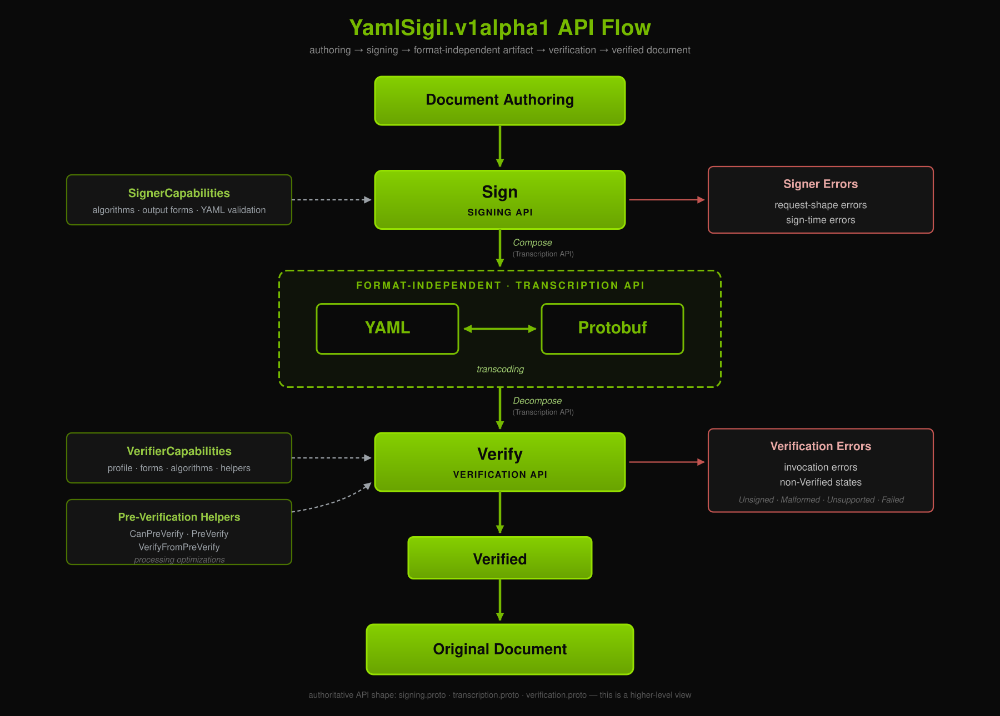

# `YamlSigil.v1alpha1` Specification

## tl;dr

`yaml-sigil` defines a user-facing signed in-toto YAML artifact format.
A YAML-form artifact is ordinary payload bytes followed by a final YAML
signature document that can be read (but not validated) without agent
tool calls:

```yaml
some: random
yaml: document
---
schema: YamlSigilSignature.v1alpha1
alg: ED25519_PUREEDDSA_RAW_RS64_CANONICAL
keyid: <optional lookup hint>
signature: <base64url signature>
```

A spec matching this didn't exist in any other form to the best of my
knowledge. This began as an exploratory effort, found its footing, and
even has a Rust implementation:
[yaml-sigil-traits](https://github.com/NVIDIA-dev/yaml-sigil-traits) +
[yaml-sigil-rs](https://github.com/NVIDIA-dev/yaml-sigil-rs).

There are [known deficiencies](#known-deficiencies) here, but they aren't
too rough around the edges in practice.

You're invited to join in helping advance the effort towards a `v1alpha2`
if you'd like to!

## Summary

<p align="center">
  
</p>

`YamlSigil.v1alpha1` defines two concrete in-toto forms for the same signed
artifact model:

- YAML form: payload bytes followed by a final YAML signature document.
- Protobuf form: serialized `SignedYamlArtifact`.

In both forms the signature covers only the payload bytes. The signature
document carries verification inputs: `schema`, `alg`, `keyid`, and
`signature`. Those fields are not authenticated claims.

## Artifact Forms

### YAML Form

A YAML-form signed artifact is a UTF-8 byte sequence whose last constrained
marker starts the signature document. A constrained marker is exactly
`---\n` or `---\r\n` at a line-start position.

```yaml
some: random
yaml: document
---
schema: YamlSigilSignature.v1alpha1
alg: ED25519_PUREEDDSA_RAW_RS64_CANONICAL
keyid: <optional lookup hint>
signature: <base64url signature>
```

Earlier constrained markers belong to the payload stream:

```yaml
some: random
yaml: document
---
some: other-random
yaml: document
---
schema: YamlSigilSignature.v1alpha1
alg: ED25519_PUREEDDSA_RAW_RS64_CANONICAL
keyid: <optional lookup hint>
signature: <base64url signature>
```

After encoding preconditions pass, YAML-form decomposition is byte-level and
parser-independent:

- No constrained marker produces `Unsigned`.
- A marker at offset `0` is valid and signs the empty byte string.
- A marker with no following signature-carrier body produces
  `MalformedAttemptedSigned`.
- A final constrained-marker span that is not a valid
  `YamlSigilSignature.v1alpha1` document produces
  `MalformedAttemptedSigned`, not `Unsigned`.

The full YAML boundary algorithm is in
[Artifact Decomposition](./artifact-decomposition.md).

### Protobuf Form

The protobuf form is serialized `yaml_sigil.v1alpha1.SignedYamlArtifact`:

- `payload` carries arbitrary payload bytes.
- `signature` carries a `YamlSigilSignature` submessage.

The protobuf payload is an arbitrary byte container. The YAML-form UTF-8,
BOM, and trailing-line-terminator rules do not apply to
`SignedYamlArtifact.payload`. A protobuf artifact whose payload does not
satisfy the YAML envelope cannot be transcoded to YAML form.

## The Signature Document

The YAML signature document and protobuf `YamlSigilSignature` are two
representations of the same logical schema. Edits MUST keep
[`proto/yaml_sigil/v1alpha1/yaml_sigil.proto`](./proto/yaml_sigil/v1alpha1/yaml_sigil.proto)
and
[`schema/YamlSigilSignature.v1alpha1.schema.json`](./schema/YamlSigilSignature.v1alpha1.schema.json)
aligned.

| Field | YAML form | Protobuf form | Rule |
| --- | --- | --- | --- |
| `schema` | Required scalar. | Message type. | YAML value MUST be `YamlSigilSignature.v1alpha1`. |
| `alg` | Required scalar. | Required `Algorithm` value. | MUST identify a schema-defined algorithm. |
| `keyid` | Optional scalar. | Optional string. | When present, MUST be non-empty and at most 1024 UTF-8 octets. It is only a lookup hint. |
| `signature` | Required base64url scalar. | Required bytes. | YAML uses the profile in [Base64 Requirements](./base64-requirements.md). Decoded signature octets MUST be non-empty before cryptographic verification. |

### Algorithms

The YAML `alg` scalar uses the canonical name. The protobuf enum uses the
`ALGORITHM_` prefix required by protobuf and Buf style.

| Slot | Canonical name | Protobuf enum constant |
| ---: | --- | --- |
| 1 | `ED25519_PUREEDDSA_RAW_RS64_CANONICAL` | `ALGORITHM_ED25519_PUREEDDSA_RAW_RS64_CANONICAL` |
| 2 | `ECDSA_SECP256R1_SHA256_RAW_RS64` | `ALGORITHM_ECDSA_SECP256R1_SHA256_RAW_RS64` |

Slot `0`, `ALGORITHM_UNSPECIFIED`, is invalid at runtime. Verifiers map it
to `MalformedAttemptedSigned`. Signers refuse it as
`InvalidOrUnsupportedAlgorithm`.

Per-algorithm rules live in:

- [`algorithms/01-ED25519_PUREEDDSA_RAW_RS64_CANONICAL.md`](./algorithms/01-ED25519_PUREEDDSA_RAW_RS64_CANONICAL.md).
- [`algorithms/02-ECDSA_SECP256R1_SHA256_RAW_RS64.md`](./algorithms/02-ECDSA_SECP256R1_SHA256_RAW_RS64.md).

### Conformance Profiles

Verifiers advertise one inner-signature-document conformance profile.

| Profile | Inner signature-document rule |
| --- | --- |
| `Strict` | Reject unknown fields and duplicate known singular fields. |
| `Permissive` | Accept per each wire form's default decode semantics. |
| `SignatureStrict` | Reject unknown fields and duplicate known singular fields on the inner signature document, while using the matching signature-strict protobuf outer-envelope mode. |

The advertised profile is a ceiling on permissiveness. A verifier MAY behave
stricter than it advertises, but MUST NOT advertise a stricter profile than it
actually enforces. Full profile rules are in
[Verification API](./verification-api.md).

## Hard Rules

- YAML-form artifact bytes MUST be valid UTF-8 and MUST NOT begin with the
  UTF-8 BOM octets `EF BB BF`.
- YAML-form payload bytes are the bytes before the selected constrained
  marker. They may be empty. A non-empty YAML-form payload necessarily ends
  with `0A` or `0D 0A` so the marker can land at a line start.
- Protobuf-form payload bytes are arbitrary octets.
- Implementations MUST run form-appropriate structural separation before
  cryptographic verification.
- Verifiers MUST return verified payload bytes only for `Verified`.
- Consumers MUST parse only verified payload bytes returned by the verifier,
  not the original artifact.
- `schema`, `alg`, `keyid`, and `signature` are unsigned verification inputs.
  Authenticated claims belong in the payload stream.

## Implementation Note

JSON Schema is the interim validation formalism for the YAML-form signature
document. The protobuf `YamlSigilSignature` message and the YAML-form JSON
Schema MUST stay aligned by hand until alignment tooling exists.

## Verifier States

| State | Meaning |
| --- | --- |
| `Verified` | Structural validation passed and cryptographic verification succeeded. |
| `Unsigned` | YAML form contains no constrained marker. Protobuf form does not produce this state. |
| `MalformedAttemptedSigned` | A signing attempt failed structural, metadata, or pre-crypto validation. |
| `SignedButAlgorithmUnsupported` | The artifact names a valid schema-defined algorithm that this verifier does not implement. |
| `SignedButFailedVerification` | Cryptographic verification was attempted and failed. |

## APIs

The `.proto` files define the implementor-facing API and wire shapes. They are
API contracts and code-generation surfaces; this specification does not
require public gRPC deployment.

| Surface | Authority |
| --- | --- |
| Artifact wire schema | [`proto/yaml_sigil/v1alpha1/yaml_sigil.proto`](./proto/yaml_sigil/v1alpha1/yaml_sigil.proto). |
| Signing API | [`signing-api.md`](./signing-api.md) and [`signing.proto`](./proto/yaml_sigil/v1alpha1/signing.proto). |
| Transcription API | [`transcription-api.md`](./transcription-api.md) and [`transcription.proto`](./proto/yaml_sigil/v1alpha1/transcription.proto). |
| Verification API | [`verification-api.md`](./verification-api.md) and [`verification.proto`](./proto/yaml_sigil/v1alpha1/verification.proto). |
| Transcoding | [`transcoding.md`](./transcoding.md). |

## References

| File | Role |
| --- | --- |
| [`artifact-decomposition.md`](./artifact-decomposition.md) | Normative YAML byte-boundary algorithm. |
| [`base64-requirements.md`](./base64-requirements.md) | Normative YAML `signature` base64 profile. |
| [`schema/README.md`](./schema/README.md) | JSON Schema maintenance notes. |
| [`conformance/README.md`](./conformance/README.md) | Normative fixture index and rebuild entry point. |
| [`DIAGRAM.md`](./DIAGRAM.md) | Non-normative API diagram companion. |
| [`original-readme.md`](./original-readme.md) | Historical starting point. |

## License

NVIDIA-authored material is licensed under the
[Apache License 2.0](./LICENSE). Third-party test data, standards-derived
material, and their redistribution requirements are documented in
[`THIRD_PARTY_NOTICES.md`](./THIRD_PARTY_NOTICES.md).

## Known Deficiencies

- `.proto` and JSON Schema alignment is maintained by hand. Automated
  alignment remains future work.
- `VerifyFromPreVerify` appears in the IDL for generated-code consistency, but
  it is an in-process and same-instance concept, not a public RPC deployment
  surface.
- Strict inner-protobuf conformance is not reliably available from stock
  protobuf parsers. Implementations that cannot reject unknown fields and
  duplicate known singular fields honestly advertise `Permissive`.

## Open Decisions

Future algorithm entries that require per-artifact-varying parameters must
define how those parameters are carried. The current `v1alpha1` algorithms
define no on-wire algorithm parameters.

## Future Enhancements

These items are outside the current `v1alpha1` conformance contract, but
remain plausible later extensions:

- Multi-signature support, probably as repeated signature entries inside one
  signature document. Multiple appended signature documents conflict with the
  last-marker YAML decomposition rule.
- DSSE transport or PAE-aligned signing, if a future version chooses to sign a
  framed payload commitment rather than raw payload bytes. That would require
  explicit mapping among DSSE `Envelope`, `SignedYamlArtifact`, and the YAML
  artifact layout.
- Formal `keyid` profiles for common key identifiers, including the encoding
  and length rules needed for interoperable lookup.
- Per-form conformance advertising, so an implementation can state stricter
  YAML behavior than protobuf behavior when its protobuf parser cannot enforce
  strict inner-message rules.
- Alternate human-oriented encodings, such as base58btc, if a future key or
  signature profile needs them and can cite stable specifications.

## Out of Scope

This format does not define key discovery, key rotation, key revocation,
transparency, replay protection, context binding, or multi-party approval.

## Glossary

| Term | Meaning |
| --- | --- |
| **Artifact** | The input byte sequence evaluated by this specification. |
| **Artifact (abstract)** | The format-free pair `(payload_bytes, signature_carrier_bytes)`. |
| **Payload stream** | The exact bytes covered by the signature. |
| **Signature document** | The YAML construct that carries `YamlSigilSignature.v1alpha1` metadata. In YAML form it is marker-inclusive. In protobuf form the analogue is the `signature` submessage in `SignedYamlArtifact`. |
| **Signature carrier** | The markerless bytes that cross the Transcription API boundary. In YAML form this is the signature document with the constrained marker removed. In protobuf form it is the length-delimited body of the outer `signature` submessage. |
| **Verified payload bytes** | The exact bytes returned by successful verification. |
| **Transcription** | The bytes-only envelope process that composes and decomposes YAML or protobuf forms. |
| **Transcoding** | Round-tripping between YAML and protobuf forms. |
| **Artifact Decomposition** | The byte-level YAML algorithm that separates a YAML-form artifact into payload and signature ranges. |
