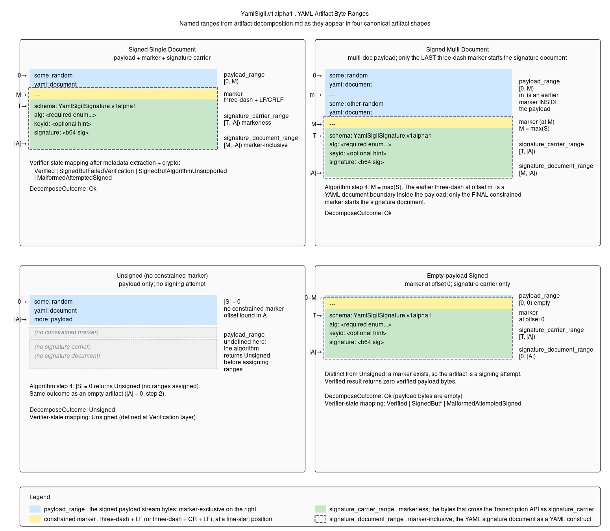

# Artifact Decomposition

This document is the **YAML implementation reference** for the
[Transcription API](./transcription-api.md)'s `Decompose` operation. It
specifies the byte-level rules that locate the boundary between the
**payload stream** and the **signature document** in a YAML-form artifact.

The Transcription API consumes this material to recover the abstract Artifact
`(payload_bytes, signature_carrier_bytes)` from YAML envelope bytes. The
analogous step on Compose — placing the constrained signature marker at a
line-start position — uses the same constrained marker profile defined here.

This stage is parser-independent. It operates only on octets and MUST NOT
depend on YAML 1.2.2 parser state. It uses the glossary terms from
[README](./README.md).

## Contract

Input:

- `A`: an octet sequence of length `|A| >= 0`; the **artifact**.

Successful output — three byte ranges over `A`:

- `payload_range = [0, M)`, where `M` is the offset of the first octet of the
  signature document's start marker. Marker-exclusive.
- `signature_document_range = [M, |A|)`. **Marker-inclusive**: the constrained
  marker bytes plus the carrier body through EOF. This is the YAML signature
  document as a YAML construct — readers see `---\n` followed by the metadata
  mapping.
- `signature_carrier_range = [T, |A|)`, where `T = M + 4` (LF marker form) or
  `T = M + 5` (CRLF marker form). **Markerless**: the carrier body alone,
  with the constrained marker bytes excluded. This is what crosses the
  [Transcription API](./transcription-api.md) boundary as
  `signature_carrier` bytes.

The relationship is fixed: `signature_carrier_range` is `signature_document_range`
with its leading marker octets removed. Implementations MAY compute either
range and derive the other; they MUST agree on `M` and `T`.

Failure output: one verifier-state failure mode from **Failure modes** below.

## Preconditions

| Requirement | Failure |
| --- | --- |
| `A` MUST be valid UTF-8. | `MalformedAttemptedSigned` |
| `A` MUST NOT begin with any byte-order mark. The UTF-8 BOM octets `EF BB BF` at offset 0 are invalid. | `MalformedAttemptedSigned` |
| Invalid UTF-8 byte patterns, including isolated continuation bytes, overlong encodings, or UTF-8-encoded surrogate code points, MUST be rejected. | `MalformedAttemptedSigned` |

Other encodings and encoding-detection heuristics are out of scope.

## Constrained Marker Profile

The signature document's start marker is one of these octet sequences at a line
start:

| Form | Octets | Text |
| --- | --- | --- |
| LF | `2D 2D 2D 0A` | `---\n` |
| CRLF | `2D 2D 2D 0D 0A` | `---\r\n` |

A line start is either offset `0` of `A`, or the offset immediately following
an `0A` octet, whether that `0A` is a lone LF terminator or the LF byte in a
`0D 0A` CRLF terminator.

A constrained marker line MUST have no preceding octets on its line, no
indentation, no whitespace or comment before the marker, and no trailing octets
between the third `-` and the line terminator. `---` at EOF and `---\r` without
`\n` are not constrained markers.

No other byte sequence may be treated as a signature-document start marker by
this stage.

## Algorithm

Each step is normative.

1. **Check encoding.** If any precondition fails, return
   `MalformedAttemptedSigned`.

2. **Handle empty input.** If `|A| = 0`, return `Unsigned`.

3. **Locate the last marker.** Find the greatest offset `M` where a constrained
   marker occurs. An offset `i` is a candidate for `M` iff:
   - `i` is a line start;
   - `A[i .. i+3] = 2D 2D 2D`; and
   - either LF form holds (`i + 4 <= |A|` and `A[i+3] = 0A`) or CRLF form holds
     (`i + 5 <= |A|` and `A[i+3 .. i+5] = 0D 0A`).

   Implementations MAY scan forward and retain only the latest candidate, or
   scan backward and stop at the first candidate. Marker discovery MUST retain
   at most one candidate offset and marker form. It MUST NOT allocate storage
   proportional to artifact length or the number of candidate markers.

4. **Select signing attempt.**
   - If no candidate exists, return `Unsigned`.
   - Otherwise, the marker at `M` starts the signature
     document. Any earlier constrained marker belongs to the signed payload.

5. **Assign ranges.** Set `payload_range = [0, M)` and
   `signature_document_range = [M, |A|)`. `M = 0` is valid and means the
   signature covers the empty byte string. Downstream stages MUST handle that
   case without special-casing it away.

6. **Require signature-carrier body.** Let `T = M + 4` for LF form or
   `T = M + 5` for CRLF form. Set `signature_carrier_range = [T, |A|)`. If
   `T = |A|`, return `MalformedAttemptedSigned`.

7. **Return ranges.** Return `(payload_range, signature_document_range, signature_carrier_range)`.
   Downstream stages select the range appropriate to their layer: the
   [Transcription API](./transcription-api.md) YAML profile consumes
   `signature_carrier_range` (markerless); narrative descriptions of the YAML
   document and YAML-parser-based metadata extraction consume
   `signature_document_range` (marker-inclusive).

## Post-Decomposition Obligation

Decomposition returns byte ranges only. Before treating the signature document
as valid metadata, the next stage MUST enforce:

> `signature_document_range` parses as exactly one constrained YAML document
> from its first byte through EOF, and that document matches
> `YamlSigilSignature.v1alpha1`.

Failure of this obligation MUST produce `MalformedAttemptedSigned`.
The YAML document-end marker `...` has no byte-layer significance and does not
change the returned ranges. Content after it still must satisfy the
single-document-through-EOF obligation.

## Failure Modes

The byte-level outcomes map directly onto the Transcription API's
`DecomposeOutcome` enum, and from there to verifier-state results defined in
[Verification API](./verification-api.md).

| Condition | `DecomposeOutcome` | Verifier-state mapping |
| --- | --- | --- |
| Non-UTF-8 octets or BOM at offset 0 | `MalformedAttemptedSigned` | `MalformedAttemptedSigned` |
| Empty artifact | `Unsigned` | `Unsigned` |
| No constrained marker found | `Unsigned` | `Unsigned` |
| Marker found but `signature_carrier_range` is empty | `MalformedAttemptedSigned` | `MalformedAttemptedSigned` |
| Valid `(payload_range, signature_document_range, signature_carrier_range)` produced | `Ok` | proceed to verification |

Artifact Decomposition never produces `Verified`,
`SignedButAlgorithmUnsupported`, or `SignedButFailedVerification`; those are
post-decomposition verifier states. Metadata-content failures such as
invalid or schema-unknown `alg` and base64 decode failure occur after
decomposition, inside Verification's metadata-extraction stage. Empty or
algorithm-invalid `signature` octets are checked in Verification's later
pre-crypto stage. The non-empty check precedes runtime algorithm-support
classification. The Transcription API treats the signature carrier as opaque
bytes and does not surface those failures.

Schema-unknown YAML `alg` strings are caught during the signature-document
parse / metadata extraction step inside Verification, not here. Where
Verification exposes pre-verification detail, this is a `MetadataParseFailure`
contributing to `MalformedAttemptedSigned`. A schema-defined `alg` value the
verifier does not implement surfaces later as `SignedButAlgorithmUnsupported`,
not as `MalformedAttemptedSigned`.

## Determinism

Two conforming implementations given the same artifact `A` MUST produce the
same output. There are no YAML parser dependencies, library-behavior
dependencies, or encoding-detection heuristics. The constrained marker profile
is intentionally narrower than YAML 1.2.2 permits so the byte boundary is
portable across languages.

## Implementation Notes

- A backward scan from `|A|` is efficient; a forward scan is also correct.
- The line-start definition is CRLF-aware. Splitting on `0A` and checking for a
  preceding `0D` is sufficient.
- As a non-normative implementation assertion, an implementation can verify
  that no constrained marker occurs inside `signature_carrier_range`. Correct
  last-marker selection makes the condition unreachable. An assertion failure
  indicates inconsistent marker discovery or selection, which is an
  implementation defect rather than an artifact condition. The specification
  defines no artifact state or `DecomposeOutcome` for it.
- Implementations SHOULD apply a maximum artifact size before scanning. A
  reasonable default is one megabyte; deployments with larger expected artifacts
  should raise it explicitly.

## Review Checklist

A reviewer should be able to verify at least the following. This list
is a starting point, not an exhaustive statement of what review should
cover:

1. The algorithm uses octet operations only.
2. Every reachable structural failure maps to a named verifier state.
3. The stage only separates byte ranges; it does not parse YAML, extract
   metadata, or declare anything verified.
4. Marker discovery retains only one candidate and does not accumulate marker
   offsets.
5. Empty artifact and no-marker artifact both produce
   `DecomposeOutcome.Unsigned`, which the [Verification API](./verification-api.md)
   maps to the verifier-state `Unsigned`; marker at offset 0 produces
   `DecomposeOutcome.Ok` with an empty payload range and proceeds to metadata
   validation.

## Diagram

- [SVG version](./images/yaml-artifact-transcription-diagram.svg)
- Non-normative: the diagram tracks this document; this document defines
  the rules. If the two disagree, this document wins.
